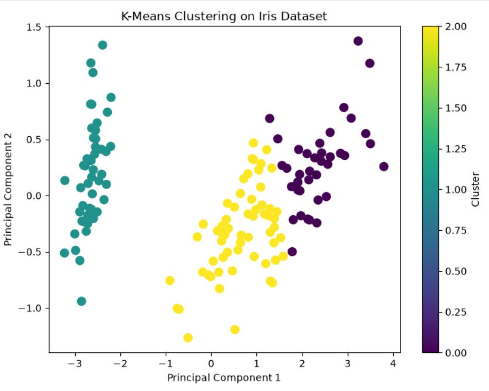
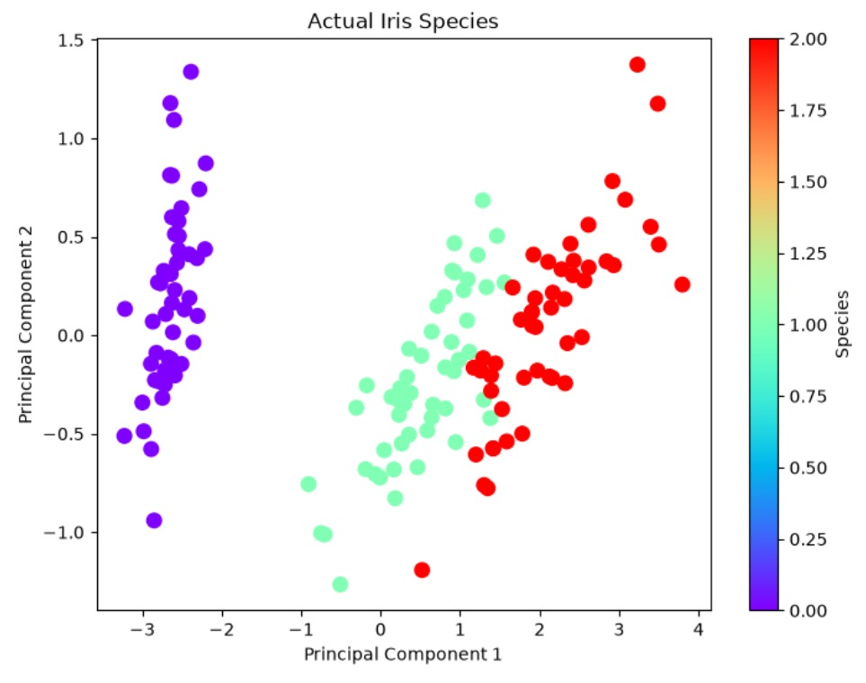

# 🌸 Iris Flower Clustering using K-Means

<div align="center">

### Unsupervised Machine Learning Project using K-Means Clustering & Principal Component Analysis (PCA)


</div>

---

## 📖 About the Project

The **Iris Flower Clustering** project demonstrates the application of the **K-Means Clustering** algorithm to identify natural groupings within the Iris dataset without using predefined labels.

To better visualize the clusters, **Principal Component Analysis (PCA)** is used to reduce the four-dimensional feature space into two principal components. The clustering results are then compared with the actual Iris species to evaluate the model's performance.

This project showcases the fundamentals of **Unsupervised Machine Learning**, **Dimensionality Reduction**, and **Data Visualization** using Python.

---

## 🎯 Objectives

- Perform K-Means Clustering with **k = 3**
- Visualize the generated clusters
- Apply Principal Component Analysis (PCA)
- Compare predicted clusters with actual species
- Evaluate clustering performance using the Adjusted Rand Index (ARI)

---

## 📂 Dataset

**Dataset:** Iris Dataset

**Source:** `sklearn.datasets.load_iris()`

| Attribute | Value |
|-----------|-------|
| Samples | 150 |
| Features | 4 |
| Classes | 3 |

### Iris Species

- 🌸 Setosa
- 🌼 Versicolor
- 🌺 Virginica

---

## 🛠️ Tech Stack

- Python
- NumPy
- Pandas
- Matplotlib
- Scikit-learn
- Jupyter Notebook

---

## 🧠 Concepts Used

- Unsupervised Learning
- K-Means Clustering
- Principal Component Analysis (PCA)
- Cluster Visualization
- Confusion Matrix
- Adjusted Rand Index (ARI)

---

## ⚙️ Project Workflow

```text
Load Dataset
      ↓
Data Preparation
      ↓
Apply K-Means Clustering
      ↓
Generate Cluster Labels
      ↓
Compare with Actual Labels
      ↓
Apply PCA
      ↓
Visualize Clusters
      ↓
Evaluate Performance
```

---

# 📷 Results

### Predicted Clusters



---

### Actual Iris Species



---

## 📊 Key Outcomes

- Successfully clustered the Iris dataset into **three distinct groups**
- Reduced four-dimensional data to two dimensions using PCA
- Visualized both predicted clusters and actual species
- Compared clustering performance using the **Adjusted Rand Index (ARI)**

---

## 📁 Repository Structure

```text
Iris-Flower-Clustering-Using-KMeans/
│
├── Iris_Flower_Clustering.ipynb
├── README.md
├── requirements.txt
├── LICENSE
└── images/
    ├── actual_species.png
    └── kmeans_clusters.png
```

---

## 🚀 Getting Started

Clone the repository

```bash
git clone https://github.com/TanisqqTech/Iris-Flower-Clustering-Using-KMeans.git
```

Move into the project directory

```bash
cd Iris-Flower-Clustering-Using-KMeans
```

Install dependencies

```bash
pip install -r requirements.txt
```

Launch Jupyter Notebook

```bash
jupyter notebook
```

Open

```
Iris_Flower_Clustering.ipynb
```

and run all cells.

---

## 💼 Skills Demonstrated

- Data Analysis
- Data Visualization
- Unsupervised Machine Learning
- K-Means Clustering
- Principal Component Analysis
- Feature Reduction
- Model Evaluation
- Python Programming
- Scikit-learn

---

## 👨‍💻 Author

**Tanishq Khareliya**

🎓 B.E. Electronics & Telecommunication Engineering

📊 Aspiring Data Analyst | Machine Learning Enthusiast

---

## 🌐 Connect with Me

**GitHub**

https://github.com/TanisqqTech

**LinkedIn**

https://www.linkedin.com/in/tanishqqkhareliya

---

⭐ If you found this project helpful, consider giving it a **Star**.
